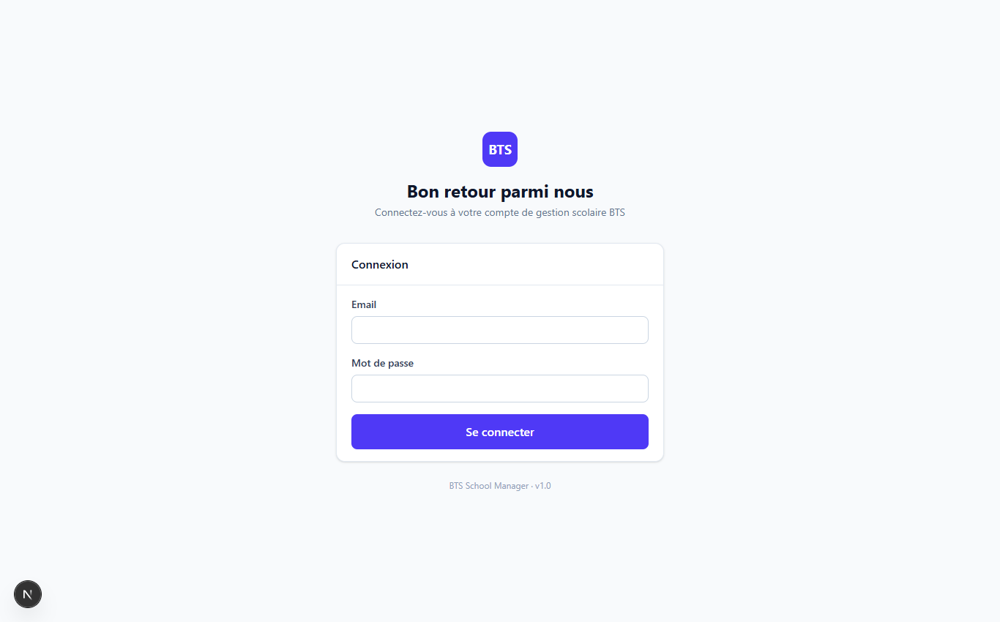
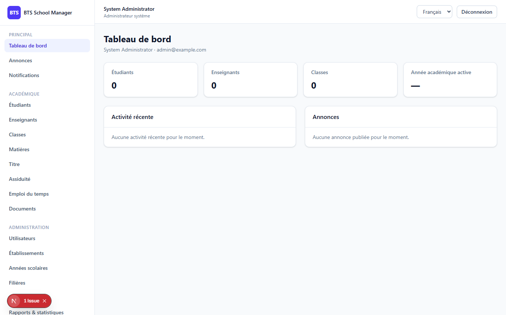

# Phase 1 — Technical Foundation

> **What this phase does:** sets up the *skeleton* of the whole system. Before this phase
> there is no working software — just a plan (Phase 0). Phase 1 gives us a runnable app
> with a database, a login screen, a dashboard, a consistent look, and the ability to
> speak three languages (French, English, Arabic). The real business features come in the
> later phases.

---

## 1. What was built (plain English)

Imagine you're building a house. Phase 1 is the **foundation and plumbing**:

- **The building materials** — the technology stack is wired together (frontend, backend,
  database, cache, Docker containers).
- **The doors and locks** — a complete login/logout system with **authentication**
  (proving who you are) and **authorization** (checking what you're allowed to do).
- **The layout** — a dashboard shell with a sidebar menu and a top bar, the same layout
  every future page will live inside.
- **The appearance** — a reusable **design system** (buttons, cards, inputs, badges) so
  every page looks consistent.
- **Three languages** — the app can be shown in French, English or Arabic.

Entering the app goes through two screens captured below.

### ✨ The Login screen (`/login`)

When a user opens the app they see a clean login form asking for email and password.



### ✨ The Dashboard (`/dashboard`)

After logging in, the user lands on the dashboard. The **sidebar on the left** is the
navigation menu. In Phase 1 only a few items exist; later phases add new menu entries as
new features appear. The **top bar** holds the user's name and a logout button.



---

## 2. The technology stack (used here for the first time)

| Piece | Technology | Job |
|-------|-----------|-----|
| Frontend framework | Next.js 16 | Renders the web pages |
| Language | TypeScript | Adds safety to JavaScript |
| Styling | Tailwind CSS 4 | Clean, consistent styles |
| Backend | Laravel 13 / PHP 8.3 | Server logic and rules |
| Auth | Laravel Sanctum (tokens) | Secure logins |
| Database | PostgreSQL 16 | Stores data |
| Cache | Redis 7 | Speed |
| Containers | Docker + docker-compose | Easy, repeatable startup |

---

## 3. How authentication works (backend)

When someone logs in, the backend (`AuthController`) does this:

1. Checks the email and password are present and correctly formatted.
2. Looks up the user by email **and** checks the password is correct.
3. Checks the account is **active** (not disabled).
4. If all good, creates a **token** — a secret string that acts like a digital key.
5. Returns the token *and* the user's permissions to the frontend.

Below is the heart of the login function (`backend/app/Http/Controllers/Api/Auth/AuthController.php`):

```php
public function login(Request $request): JsonResponse
{
    $validated = $request->validate([
        'email' => ['required', 'email'],
        'password' => ['required', 'string'],
    ]);

    $user = User::where('email', $validated['email'])->first();

    // 2. Check password
    if (! $user || ! Hash::check($validated['password'], $user->password)) {
        return response()->json(['message' => 'Invalid credentials.'], 401);
    }

    // 3. Check the account is active
    if (! $user->is_active) {
        return response()->json([
            'message' => 'Your account is deactivated. Contact an administrator.',
        ], 403);
    }

    // 4. Create a token (the digital key)
    $token = $user->createToken('api-token', [$user->role])->plainTextToken;

    return response()->json([
        'message' => 'Login successful.',
        'token'   => $token,
        'user'    => [
            ...$user->toArray(),
            'permissions' => $this->permissionsForRole($user->role),
        ],
    ]);
}
```

**In plain English:** the backend never stores or sends the password back. It only
compares the password using a secure one-way hash (`Hash::check`), then hands the
frontend a **token**. The token is the "key" that authenticates the user on every later
request.

---

## 4. How the frontend remembers you are logged in

The frontend stores the token in the browser's **localStorage** and sends it with every
API call inside an `Authorization: Bearer <token>` header.

Look at the interceptor in `frontend/lib/api.ts` — this runs before **every** request:

```ts
api.interceptors.request.use((config) => {
  if (typeof window !== "undefined") {
    const token = window.localStorage.getItem(TOKEN_KEY); // "bts_access_token"
    if (token) {
      config.headers.Authorization = `Bearer ${token}`;
    }
  }
  return config;
});
```

And the login handler in `frontend/lib/auth.tsx` saves the token and the user:

```ts
const login = useCallback(async (email: string, password: string) => {
  const data = await api.post<LoginResponse>("/auth/login", { email, password });
  window.localStorage.setItem(TOKEN_KEY, data.data.token);
  setUser(data.data.user);
}, []);
```

A small helper `hasPermission(...)` checks the logged-in user's permission list — this is
used to **hide** buttons you're not allowed to press (a first, user-friendly layer).
Remember: the real security check still happens on the backend.

---

## 5. The permission check (backend security)

Every protected API route is wrapped in the `auth:sanctum` middleware (must be logged in)
and often also a `permission:module.action` middleware (must have permission).

The middleware `backend/app/Http/Middleware/CheckPermission.php`:

```php
public function handle(Request $request, Closure $next, string $permission): Response
{
    $user = $request->user();

    if (! $user || ! $user->hasPermission($permission)) {
        return response()->json([
            'message' => 'You do not have permission to perform this action.',
        ], 403);
    }

    return $next($request);
}
```

`User::hasPermission(...)` checks the user's role → its permissions → is this one there?

```php
public function hasPermission(string $permission): bool
{
    $role = $this->role()->first();
    if (! $role) return false;
    return $role->permissions()->where('name', $permission)->exists();
}
```

---

## 6. The API map (`backend/routes/api.php`)

The `routes/api.php` file is the **map** of every web address the API exposes. In Phase 1
it includes:

```php
Route::prefix('v1')->group(function () {
    Route::get('/health', [HealthController::class, 'index']);   // public health check

    // Public auth (note the rate limiting: max 5 tries per minute)
    Route::post('/auth/login', [AuthController::class, 'login'])
        ->middleware('throttle:5,1');

    // Authenticated routes
    Route::middleware('auth:sanctum')->group(function () {
        Route::post('/auth/logout', [AuthController::class, 'logout']);
        Route::get('/auth/me', [AuthController::class, 'me']);
        Route::put('/auth/password', [AuthController::class, 'changePassword']);
        // ...later phases add /students, /grades, /attendance, etc.
    });
});
```

---

## 7. A sample database table (migrations)

The database structure is defined in **migration** files — one per table. A migration is
a PHP file that describes what columns a table has. Example (`backend/database/migrations/..._create_schools_table.php`):

```php
Schema::create('schools', function (Blueprint $table) {
    $table->id();
    $table->string('name');
    $table->string('code')->nullable()->unique();
    $table->string('city')->nullable();
    $table->string('phone')->nullable();
    $table->string('email')->nullable();
    $table->boolean('is_active')->default(true);
    $table->timestamps();
});
```

**Plain English:** this creates (or recreates) a `schools` table holding one school per
row — name, an optional unique code, city, phone, email, whether it's active, and
automatic timestamps. Migrations let the whole team recreate the exact same database
anywhere, which is a huge benefit.

---

## 8. The design system & i18n (frontend)

### Design system

The frontend has a folder of **reusable components** (in `frontend/components/`):

- `ui/` — basics: `button.tsx`, `card.tsx`, `input.tsx`, `badge.tsx`, `spinner.tsx`, ...
- `admin/` — table helpers: `modal.tsx`, `confirm-dialog.tsx`, `pagination.tsx`
- `dashboard/` — `stat-card.tsx` (for KPI numbers)
- `layout/` — `sidebar.tsx`, `topbar.tsx`

### i18n (languages)

Every user-facing sentence is a **key**, translated in `frontend/messages/{fr,en,ar}.json`.
The components read text through `useI18n()` → `t("key")`. For example, in the login page:
`{t("auth.welcome_back")}`. When the language changes, all text changes automatically.

---

## ✅ Definition of "done" for this phase

A feature is only considered "done" when all of these are coherent:

- UI (the screen) ✔
- API (backend endpoints) ✔
- Database (migrations) ✔
- Permissions ✔
- Validation (checking inputs are correct) ✔
- Error / loading / empty states ✔
- Tests ✔
- Responsive design (works on mobile too) ✔
- Documentation ✔

---

**Next:** Phase 2 adds the first real business feature — administration.
➡️ [02-phase2-administration.md](02-phase2-administration.md)
