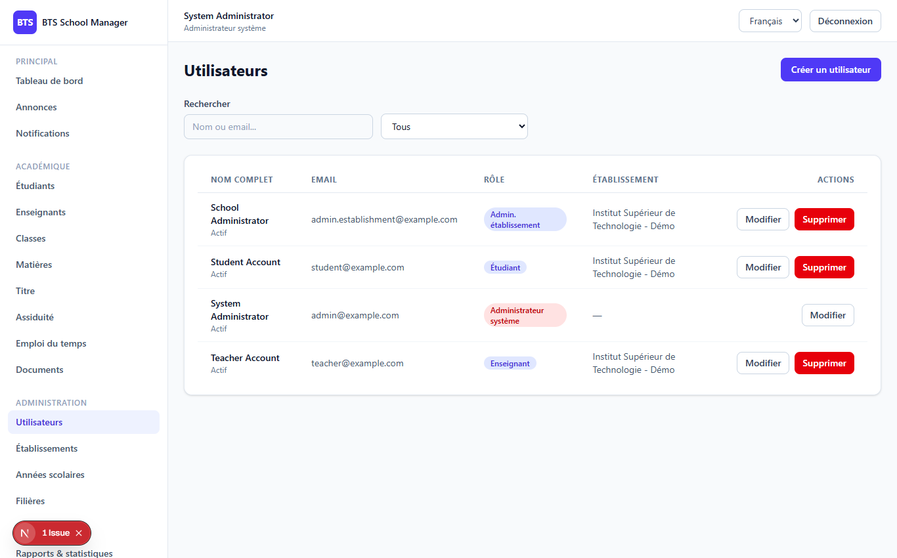
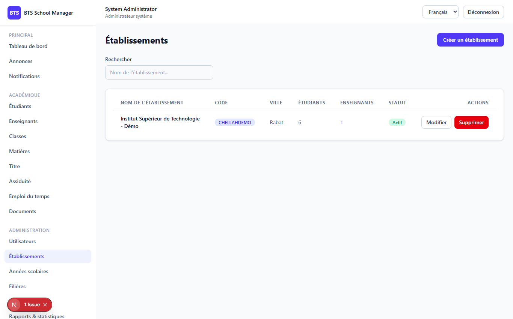
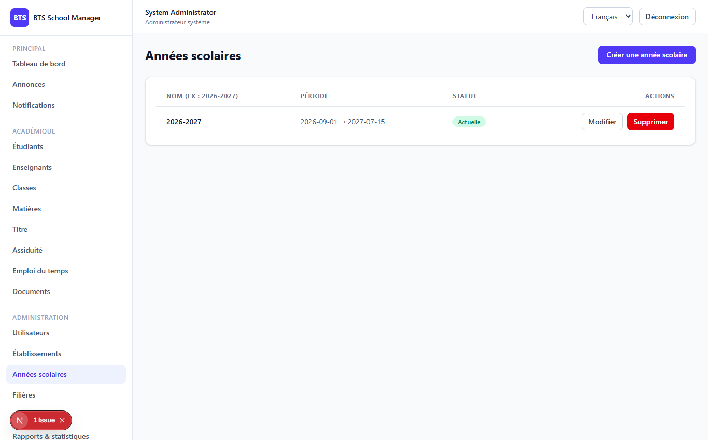
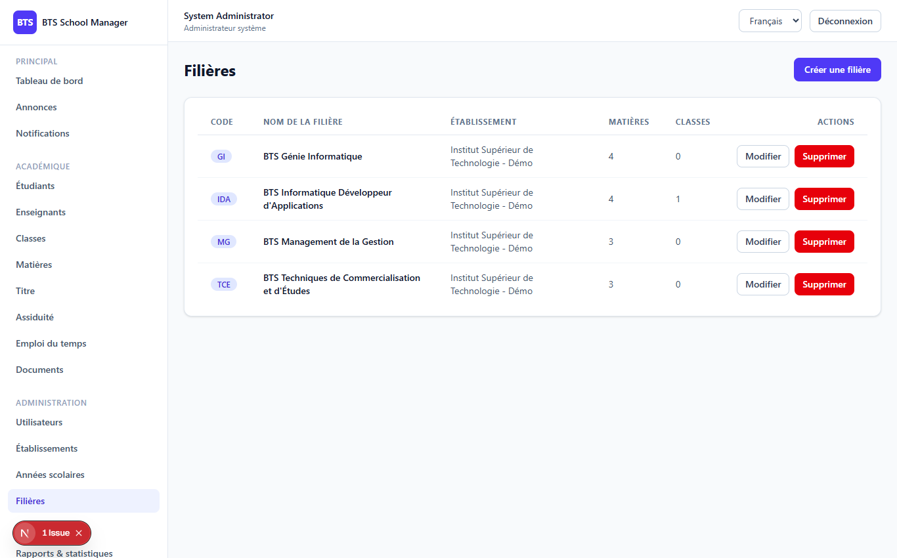
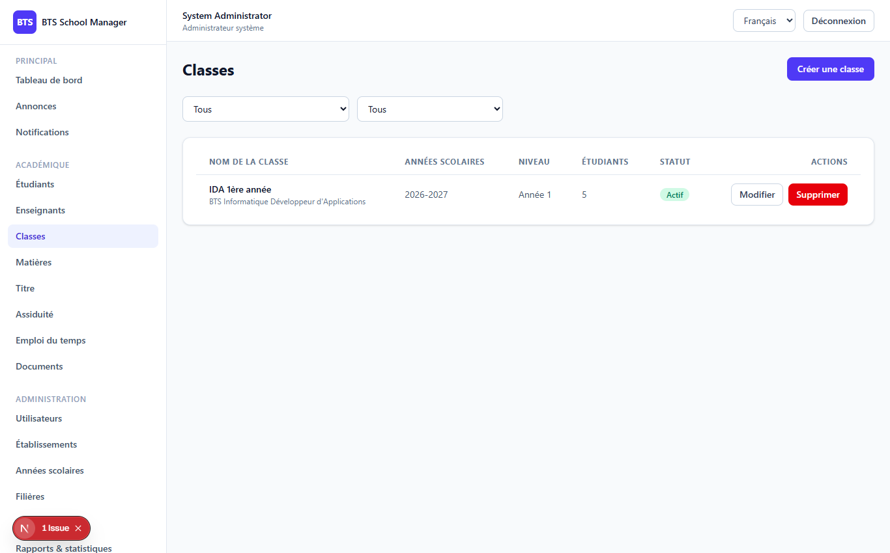
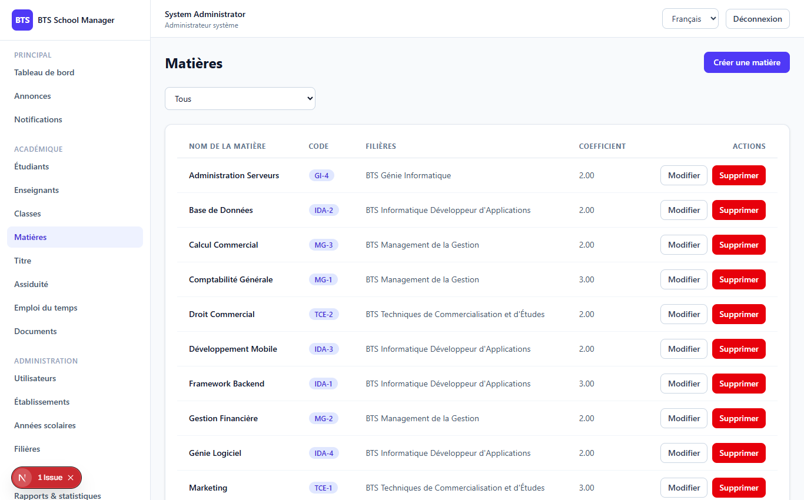

# Phase 2 — Administration

> **What this phase does:** builds the *administration* part of the system. This is the
> "back-office" where a system admin sets up the whole platform: schools, the people
> using it, school years, programs (filières), classes and subjects. Everything else in
> the later phases depends on this data existing first.

---

## 1. What was built (plain English)

Phase 2 provides the building blocks that the rest of the app is made of:

| Module | What it is | Who manages it |
|--------|-----------|----------------|
| **Users & Roles** | The people who log in, and their role (which defines permissions) | System admin |
| **Schools** | The establishments (e.g. "BTS Casablanca") | System admin (only them) |
| **Academic years** | School years, e.g. "2025/2026"; one is flagged as *current* | System admin |
| **Programs** | The courses of study ("filières") offered by a school | System admin / establishment admin |
| **Classes** | A concrete group (e.g. "MERN 1A") belonging to a program | Both admins |
| **Subjects** | Individual subjects taught, e.g. "Mathematics" | Both admins |

The most important new idea in this phase is **school scoping** — see section 4 below.

---

## 2. The screens (frontend views)

### Admin → Users (`/dashboard/admin/users`)

Manage accounts and their roles.



### Admin → Schools (`/dashboard/admin/schools`)

Only system admins can create or edit schools. Each school shows how many students
and teachers it has.



### Admin → Academic years (`/dashboard/admin/academic-years`)

Define school years. One year is marked as **current** (the exclusive `is_current` flag).



### Admin → Programs (`/dashboard/admin/programs`)

Programs (filières) belong to a school and hold classes and subjects.



### Classes (`/dashboard/classes`)

Classes belong to a program and an academic year.



### Subjects (`/dashboard/subjects`)

Subjects belong to a program and carry a coefficient (weight used to compute averages).



---

## 3. How the API works (backend)

A clean pattern is used for every module. Take **schools**. The routes in
`backend/routes/api.php` (already shown in Phase 1) are:

```
GET    /admin/schools            -> list schools          (needs settings.view)
POST   /admin/schools            -> create a school       (needs settings.update)
GET    /admin/schools/{school}   -> show one school       (needs settings.view)
PUT    /admin/schools/{school}   -> update a school       (needs settings.update)
DELETE /admin/schools/{school}   -> delete a school       (needs settings.update)
```

The controller `SchoolController` contains one function per route. Highlights:

```php
public function index(Request $request)
{
    $query = School::query()
        ->withCount(['students', 'teachers'])         // include student/teacher counts
        ->when($request->filled('search'), fn ($q) => $q->where('name', 'like', '%'.$request->input('search').'%'))
        ->orderBy('name');

    if ($request->user()->isEstablishmentAdmin()) {
        $query->where('id', $request->user()->school_id);   // <--- SCHOOL SCOPING
    }

    return SchoolResource::collection($query->paginate($request->integer('per_page', 15)));
}
```

And only a **system admin** may create, edit or delete a school:

```php
public function store(StoreSchoolRequest $request)
{
    if (! $request->user()->isSystemAdmin()) {
        return response()->json([
            'message' => 'Seul l\'administrateur système peut créer un établissement.',
        ], 403);
    }
    $school = School::create($request->validated());
    return (new SchoolResource($school))->response()->setStatusCode(201);
}
```

> Note: the error messages in the code are in French ("Seul l'administrateur système
> peut créer un établissement" = "Only the system administrator can create an
> establishment"). The frontend translates its own messages; backend messages may still
> be French.

---

## 4. School scoping — the key idea

**School scoping** means: *an establishment admin should only ever see and modify data
that belongs to their own school.*

The pattern appears everywhere:

```php
if ($request->user()->isEstablishmentAdmin()) {
    $query->where('school_id', $request->user()->school_id);
}
```

- On **read** operations (index/show), results are filtered down to the admin's school.
- On **create/update**, the `school_id` is forcibly set to the admin's own school.

Only a **system admin** (who is not tied to a school) sees *everything*.

Another scoping rule from this phase: **an establishment admin cannot delete users**
(they lack the `users.delete` permission — it's deliberately not granted to them).

A third rule: **`is_current` is exclusive** — when you mark one academic year as current,
the system clears the flag on all other years of that school (so there is always exactly
one current year).

---

## 5. How a frontend page is built (example: Schools)

Let's look at the pattern used by **every** admin page, using the schools page as the
example (`frontend/app/dashboard/admin/schools/page.tsx`). The page:

1. **Loads data** when it opens (and when you change page or search).
2. **Shows the list** in a table (or a loading spinner / empty message).
3. Lets you **create / edit** with a modal form.
4. Lets you **delete** with a confirmation dialog.

The data loading (reading from the API):

```ts
const load = useCallback(async (targetPage: number, searchTerm: string) => {
  const result = await fetchSchools({ page: targetPage, per_page: 15, search: searchTerm || undefined });
  setItems(result.data);
  setTotal(result.total);
  setLastPage(result.last_page);
  setPage(result.current_page);
}, []);
```

The "Create School" button only shows for system admins (an **extra** UI-layer check):

```tsx
const isSystemAdmin = user?.role === "admin_system";
...
{isSystemAdmin && <Button onClick={openCreate}>{t("admin.schools.create")}</Button>}
```

The table shows the data with language-aware labels and badges:

```tsx
{items.map((item) => (
  <tr key={item.id} className="hover:bg-slate-50">
    <td className="px-5 py-3 font-medium text-slate-900">{item.name}</td>
    <td className="px-5 py-3">{item.code && <Badge variant="info">{item.code}</Badge>}</td>
    <td className="px-5 py-3">
      {item.is_active ? <Badge variant="success">{t("admin.active")}</Badge>
                      : <Badge variant="warning">{t("admin.inactive")}</Badge>}
    </td>
    ...
  </tr>
))}
```

The API helpers live in `frontend/lib/admin-api.ts`. They are thin wrappers around the
`api` client (which already adds the auth token). Example:

```ts
export async function fetchSchools(params) {
  const { data } = await api.get<Paginated<School>>("/admin/schools", { params });
  return data;
}
```

---

## 6. Try it yourself

1. Log in as **system admin** (`admin@example.com` / `password`).
2. Open **Admin → Schools** → **Create** a new school.
3. Open **Admin → Academic years** → add a year and mark it current.
4. Open **Admin → Programs** → add a program to the school.
5. Open **Classes** and **Subjects** → create records linked to that program.

Now you have the base data that the next phase (Students) will build upon.

---

**Next:** Phase 3 adds Students.
➡️ [03-phase3-students.md](03-phase3-students.md)
