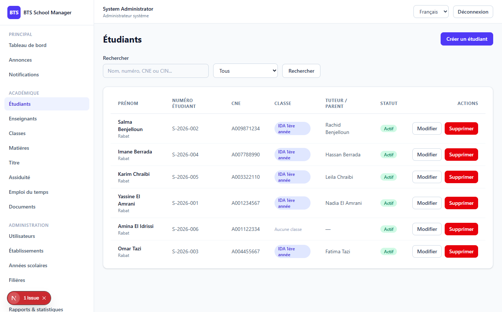

# Phase 3 — Students

> **What this phase does:** adds the ability to manage **students**. A student record
> holds the person's identity (name, birth date, CIN/CNE numbers...), their **status**
> (active, graduated, withdrawn...), an optional **guardian** (parent/legal contact), and
> an optional **class** they are enrolled in for the current academic year.

Up to this point the system could manage schools and structure, but not the *people* at
the heart of it. Phase 3 fixes that for the **students**.

---

## 1. The Student screen (`/dashboard/students`)

The main students page is a searchable table. Clicking **Create** opens a form where you
enter the student's identity, choose a school & class, and optionally add a guardian.



---

## 2. What a "student record" contains

Looking at the database migration (`..._create_students_table.php`) shows exactly what
fields a student has:

```php
Schema::create('students', function (Blueprint $table) {
    $table->id();
    $table->foreignId('user_id')->nullable()->constrained()->nullOnDelete(); // optional link to a login account
    $table->foreignId('school_id')->constrained()->cascadeOnDelete();        // which school they belong to
    $table->string('student_number')->nullable()->unique();                  // the school's own student number
    $table->string('cne')->nullable()->unique();                             // national student number
    $table->string('cin')->nullable();                                       // national ID card number
    $table->string('first_name');
    $table->string('last_name');
    $table->date('birth_date')->nullable();
    $table->string('birth_place')->nullable();
    $table->string('gender')->nullable();
    $table->string('address')->nullable();
    $table->string('city')->nullable();
    $table->string('phone')->nullable();
    $table->string('email')->nullable();
    $table->string('photo_path')->nullable();
    $table->string('status')->default('active');  // active, graduated, transferred, withdrawn, suspended, inactive
    $table->timestamps();
    $table->softDeletes();                        // soft delete = record kept but marked deleted
});
```

**Plain English of the interesting bits:**

- `school_id` — which school owns this student (this is what enables school scoping).
- `status` — students can be `active`, `graduated`, `transferred`, `withdrawn`,
  `suspended` or `inactive`.
- `softDeletes()` — deleting a student doesn't wipe it from the database; it adds a
  *deleted_at* timestamp. This is safer (you can undo mistakes).

---

## 3. Guardians (parents / legal contacts)

A student can have **guardians**. In the data model this is a related table
(`student_guardians`). When saving a student, you can pass a `guardian` object. The
controller handles create/update/delete of the guardian for you:

```php
if ($request->filled('guardian')) {
    $guardian = $request->input('guardian');
    $fill = collect($guardian)->except('id')->all();

    if (! empty($guardian['id'])) {
        $student->guardians()->whereKey($guardian['id'])->update($fill); // update existing
    } elseif ($student->guardians()->exists()) {
        $student->guardians()->first()->update($fill);                    // update first
    } else {
        $student->guardians()->create($fill);                             // create new
    }
} elseif ($request->has('guardian')) {
    $student->guardians()->delete();                                      // remove guardians
}
```

The API **response** for a student includes nested `guardians` and a `guardians_count`,
so the interface can show how many guardians each student has.

---

## 4. Enrollment into a class

When you create or update a student you may pass a `class_id`. The `syncEnrollment`
helper ties the student to that class **for the right academic year** and keeps two
tables in sync (`enrollments` and `class_students`):

```php
private function syncEnrollment(Student $student, ?int $classId): void
{
    if (! $classId) return;

    $class = SchoolClass::find($classId);
    if (! $class) return;

    // Use the class's own year, or fall back to the school's current academic year
    $academicYearId = $class->academic_year_id
        ?: AcademicYear::where('school_id', $student->school_id)->where('is_current', true)->value('id');

    // Keep class_students in sync; enrollments records the year + date
    $student->classes()->syncWithoutDetaching([$classId]);
    $student->enrollments()->updateOrCreate(
        ['class_id' => $classId, 'academic_year_id' => $academicYearId],
        ['enrollment_date' => now()->toDateString(), 'status' => 'active']
    );
}
```

The response also includes a **`current_class`** summary so the UI can show which class
a student is in right now.

---

## 5. School scoping (continued from Phase 2)

The same scoping rule is applied. For example, when showing or updating a student, the
establishment admin is limited to their own school:

```php
if ($request->user()->isEstablishmentAdmin() && $student->school_id !== $request->user()->school_id) {
    return response()->json(['message' => 'Resource not found.'], 404);
}
```

And on create/update, an establishment admin cannot change the school away from their own.

---

## 6. Searching & filters

The **list** supports searching and filtering to make large collections usable:

```php
->when($request->filled('status'),   fn ($q) => $q->where('status', $request->input('status')))
->when($request->filled('class_id'), fn ($q) => $q->whereHas('classes', fn ($c) => $c->where('classes.id', $request->input('class_id'))))
->when($request->filled('school_id'),fn ($q) => $q->where('school_id', $request->input('school_id')))
->when($request->filled('search'), function ($q) use ($request) {
    $q->where(fn ($sub) => $sub->where('first_name', 'like', "%{$request->input('search')}%")
        ->orWhere('last_name', 'like', "%{$request->input('search')}%")
        ->orWhere('student_number', 'like', "%{$request->input('search')}%")
        ->orWhere('cne', 'like', "%{$request->input('search')}%")
        ->orWhere('cin', 'like', "%{$request->input('search')}%"));
})
->orderBy('last_name')->orderBy('first_name');
```

In plain English: you can search by first/last name, student number, CNE or CIN; and
filter by status, class, or school.

---

## 7. Permissions for students

From the phase notes:

- `students.view/create/update/delete` — **system admin** and **establishment admin** get
  full control.
- `teacher` and `student` roles only get **`students.view`** (read-only).

So a teacher can look up students but cannot create or delete them.

---

## ✅ What this phase gives you

- A full **Students** page: search, add, edit, delete, view.
- Student profiles with identity details, status and photo.
- Optional **guardians** associated with each student.
- **Enrollment** of students into classes for the correct academic year.
- Consistent **school scoping** and **permissions** carried over from Phase 2.

---

**Next:** Phase 4 adds Teachers.
➡️ [04-phase4-teachers.md](04-phase4-teachers.md)
