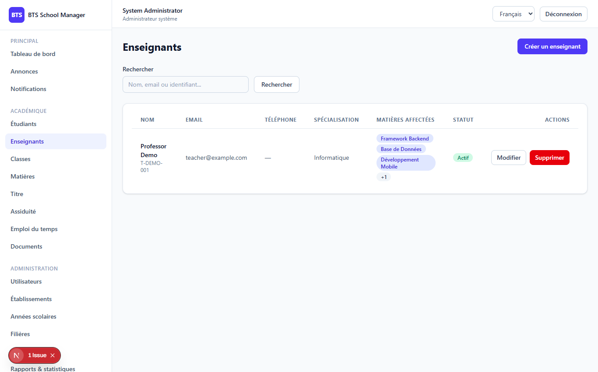

# Phase 4 — Teachers

> **What this phase does:** adds teacher management. A **teacher** record holds the
> person's identity and their **subject assignments** — which subjects they are allowed
> or responsible to teach. Later phases (grades, attendance, timetable) rely on knowing
> which teacher is associated with a subject/class.

---

## 1. The Teachers screen (`/dashboard/teachers`)

The teachers page is a searchable table with a form (modal) to create/edit a teacher and
tick which subjects they teach.



---

## 2. What a teacher record contains

A teacher has profile fields plus a link to one or more **subjects** they teach. The
relationship is stored in a pivot table (`teacher_subject_assignments`).

The list supports filtering by `search`, `specialization`, `is_active`, and `school_id`:

```php
$query = Teacher::query()
    ->with(['school', 'subjects'])
    ->withCount('assignments')
    ->when($request->filled('specialization'), fn ($q) => $q->where('specialization', 'like', '%'.$request->input('specialization').'%'))
    ->when($request->filled('is_active'), fn ($q) => $q->where('is_active', $request->boolean('is_active')))
    ->when($request->filled('school_id'), fn ($q) => $q->where('school_id', $request->input('school_id')))
    ->when($request->filled('search'), function ($q) use ($request) {
        $search = $request->input('search');
        $q->where(fn ($sub) => $sub->where('first_name', 'like', "%{$search}%")
            ->orWhere('last_name', 'like', "%{$search}%")
            ->orWhere('email', 'like', "%{$search}%")
            ->orWhere('internal_identifier', 'like', "%{$search}%"));
    })
    ->orderBy('last_name')->orderBy('first_name');
```

As always, establishment admins are scoped to their own school:

```php
if ($request->user()->isEstablishmentAdmin()) {
    $query->where('school_id', $request->user()->school_id);
}
```

---

## 3. Subject assignments (the important new bit)

When you save a teacher you can send a `subject_ids[]` list — the list of subjects they
teach. The `syncAssignments` method synchronises that list with the database (it figures
out what to add and what to remove):

```php
private function syncAssignments(Teacher $teacher, array $subjectIds): void
{
    $existing = $teacher->assignments()->pluck('subject_id')->all();
    $toAdd    = array_diff($subjectIds, $existing);
    $toRemove = array_diff($existing, $subjectIds);

    if (! empty($toRemove)) {
        $teacher->assignments()->whereIn('subject_id', $toRemove)->delete();
    }

    foreach ($toAdd as $subjectId) {
        $teacher->assignments()->firstOrCreate(['subject_id' => $subjectId]);
    }
}
```

The HTTP request carries the subject list separately from the normal student fields,
which is why the controller pulls it out before saving:

```php
$data = $request->validated();
$subjectIds = $data['subject_ids'] ?? [];
unset($data['subject_ids']);

$teacher = Teacher::create($data);

if (! empty($subjectIds)) {
    $this->syncAssignments($teacher, $subjectIds);
}
```

The **API response** (`TeacherResource`) includes the nested `school`, `subjects`, and
`assignments_count`, so the interface can show how many subjects a teacher teaches.

---

## 4. Permissions for teachers

- `teachers.view/create/update/delete` — **system admin** and **establishment admin** get
  full control.
- `teacher` and `student` roles have **no** `teachers.*` permission — they cannot access
  the teachers endpoint at all.

This makes sense: only the administrators of a school manage the teaching staff.

---

## 5. Frontend helpers

The frontend talks to this API through `frontend/lib/admin-api.ts`:

```ts
// fetchTeachers, createTeacher, updateTeacher, deleteTeacher
export async function fetchTeachers(params?: TeacherFilters) {
  const { data } = await api.get<Paginated<Teacher>>("/teachers", { params });
  return data;
}
```

The page lets you pick multiple subjects with checkboxes and toggle whether the teacher
is active, all wrapped in the reusable `Modal` and `ConfirmDialog` components.

---

## ✅ What this phase gives you

- A full **Teachers** page: search, add, edit, delete.
- Teacher profiles with school and active status.
- **Subject assignments** via the `teacher_subject_assignments` pivot.
- School scoping + permissions consistent with previous phases.

---

**Next:** Phase 5 adds Grades.
➡️ [05-phase5-grades.md](05-phase5-grades.md)
