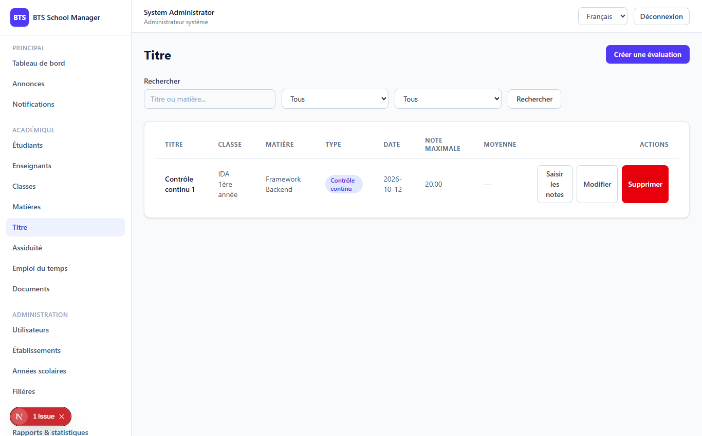

# Phase 5 — Grades (Notes)

> **What this phase does:** adds the **grading system**. Teachers create *assessments*
> (an exam, quiz, homework, project...), enter a score for each student, and then
> **publish** or **lock** the results. Grade entry is only allowed for students actually
> enrolled in the class, and once published, grades can no longer be changed.

---

## 1. The Grades screen (`/dashboard/grades`)

The grades page lists assessments with filters (class / subject / search). Clicking into
an assessment opens the **grade entry view** — a list of that class's students with a
score box and comment for each row, plus **Save / Publish / Lock** buttons.



---

## 2. The two key concepts

### Assessments

An **assessment** is a graded event. It belongs to a class, a subject, a teacher and an
academic year. It has a *type*:

`exam`, `quiz`, `homework`, `practical`, `project`, `continuous`

...plus a `max_score` (out of how many), a `weight` (how heavily it counts), and flags
`is_published` and `is_locked`.

### Grades

A **grade** is one student's score on one assessment. Each grade row holds `score`,
`comment`, and `published_at`. A grade is unique per `(assessment, student)`.

---

## 3. The "grade stream" — the nice trick for entry

To make entering grades easy, the backend provides a **`grade-stream`** endpoint. It
returns *all the students enrolled in the class*, with their current score if any, and
`null` if none has been entered yet. This is exactly what the table on the page needs.

From `GradeController`:

```php
public function stream(Request $request, Assessment $assessment)
{
    $class = $assessment->schoolClass;

    // Which students are expected? Those enrolled in this class for this academic year.
    $expected = $class && $class->academic_year_id
        ? Enrollment::where('class_id', $class->id)
            ->where('academic_year_id', $assessment->academic_year_id)
            ->pluck('student_id')
        : collect();

    $existing = $assessment->grades()->get()->keyBy('student_id');

    $students = $class
        ? $class->students()->whereIn('students.id', $expected)->get([...])
        : collect();

    // Combine: each student row + their existing score (or null)
    $rows = $students->map(function ($student) use ($existing) {
        $grade = $existing->get($student->id);
        return [
            'student_id'    => $student->id,
            'first_name'    => $student->first_name,
            'last_name'     => $student->last_name,
            'student_number'=> $student->student_number,
            'score'         => $grade?->score,
            'comment'       => $grade?->comment,
        ];
    });

    return response()->json(['data' => $rows->values()]);
}
```

---

## 4. Saving grades (and the publish rule)

Grades are saved with a **bulk update** — you send an array of rows and the backend
uses `updateOrCreate` (insert if new, update if it exists):

```php
public function update(UpdateGradesRequest $request, Assessment $assessment)
{
    // ... permission check ...

    if ($assessment->is_published) {
        return response()->json([
            'message' => 'Les notes ont déjà été publiées et ne peuvent plus être modifiées.',
        ], 422);
    }

    foreach ($request->input('grades') as $row) {
        Grade::updateOrCreate(
            ['assessment_id' => $assessment->id, 'student_id' => $row['student_id']],
            ['score' => $row['score'], 'comment' => $row['comment'] ?? null],
        );
    }

    return response()->json(['message' => 'Notes enregistrées.']);
}
```

**The important safety rule:** once an assessment is **published**, grade updates are
rejected (HTTP 422). This protects students' results from being silently changed after
they are made public.

---

## 5. Publish & lock

- **Publish** (`POST /assessments/{id}/publish`) — marks `is_published = true`. From now
  on, grades can no longer be updated.
- **Lock** (`POST /assessments/{id}/lock`) — freezes the assessment entirely (idempotent,
  i.e. calling it twice is harmless).

A locked assessment can no longer even be edited via the normal update endpoint:

```php
if ($assessment->is_locked) {
    return response()->json([
        'message' => 'Cet examen est verrouillé et ne peut plus être modifié.',
    ], 422);
}
```

---

## 6. Permissions for grades

- `grades.view/create/update` — **system admin**, **establishment admin** and **teacher**.
- A **teacher** is auto-assigned as the assessment's teacher when they create it, and can
  only grade assessments where they are the assigned teacher.
- `student` has no grade permissions (students only *see* their own results via their
  read-only view in later/reports flows).

The `canAccess` helper (in `GradeController`) shows how the permission logic differs by
role:

```php
if ($request->user()->isEstablishmentAdmin()) {
    return $schoolId === $request->user()->school_id;
}
if ($request->user()->isTeacher()) {
    $teacher = Teacher::where('user_id', $request->user()->id)->first();
    return $teacher ? $assessment->teacher_id === $teacher->id : false;
}
return $request->user()->isSystemAdmin();
```

---

## ✅ What this phase gives you

- Create / edit / delete **assessments** (with filters and search).
- Enter **grades** for enrolled students via the grade-stream view.
- **Publish** (freeze grades) and **lock** (freeze everything) controls.
- Automatic teacher assignment + strict `canAccess` scoping.
- Assessment resource exposing grades count, students count and average.

---

**Next:** Phase 6 adds Attendance.
➡️ [06-phase6-attendance.md](06-phase6-attendance.md)
