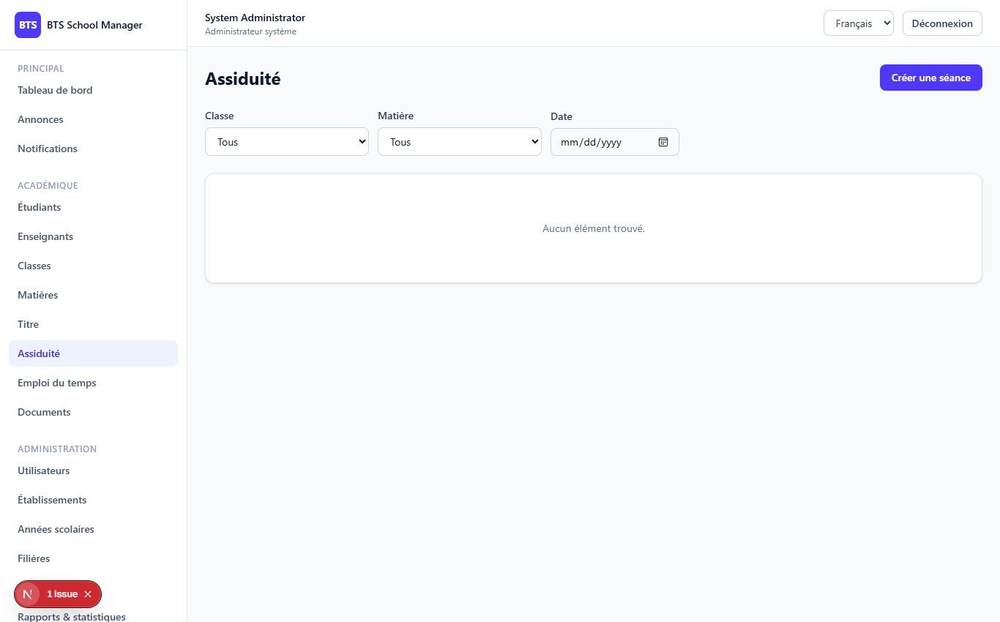

# Phase 6 — Attendance (Assiduité)

> **What this phase does:** adds the **attendance** system. A teacher creates an
> *attendance session* (for a class, subject, date and time), then marks each student as
> **present**, **absent**, **late** or **justified** (with an optional justification note).

---

## 1. The Attendance screen (`/dashboard/attendance`)

The attendance page lists sessions with filters (class / subject / date). Clicking a
session opens the marking view: one row per student with a status drop-down, and a
justification field when a student is marked "justified".



---

## 2. Sessions and records

There are two related concepts:

- **Attendance session** — one class session: which class, subject, teacher, date, and
  start/end time.
- **Attendance record** — one student's mark for one session: `status` plus an optional
  `justification`.

The status values are:

```
present | absent | late | justified
```

Related count helpers on the session model give per-status totals (present_count,
absent_count, late_count, justified_count) so the list can show a quick summary.

---

## 3. The "stream" pattern (same idea as grades)

Just like grades, attendance uses a **`stream`** endpoint so the marking UI can display
every enrolled student with their current status. Notice the clever default: if no record
exists yet, the status defaults to **`present`** (`?? 'present'`), which speeds up marking
for a typical class where most students are present.

```php
$rows = $students->map(function ($student) use ($existing) {
    $record = $existing->get($student->id);
    return [
        'student_id'    => $student->id,
        'first_name'    => $student->first_name,
        'last_name'     => $student->last_name,
        'student_number'=> $student->student_number,
        'status'        => $record?->status ?? 'present',   // <-- default to present
        'justification' => $record?->justification,
    ];
});
```

---

## 4. Saving the marks

Marks are saved in bulk, again using `updateOrCreate` (so it works for both new and
existing records):

```php
public function updateRecords(StoreAttendanceRecordsRequest $request, AttendanceSession $session)
{
    // ... permission check ...

    foreach ($request->input('records') as $row) {
        AttendanceRecord::updateOrCreate(
            ['attendance_session_id' => $session->id, 'student_id' => $row['student_id']],
            ['status' => $row['status'], 'justification' => $row['justification'] ?? null],
        );
    }

    return response()->json(['message' => 'Présences enregistrées.']);
}
```

---

## 5. Permissions & scoping

- `attendance.view/create/update` — system admin, establishment admin, and **teacher**.
- A teacher is **auto-assigned** as the session's teacher when they create it.
- A teacher can **view** a session if they are its teacher *or* it has no teacher
  (`teacher_id === null`), and can **manage** (edit) only sessions they own.
- Establishment admins are scoped to their own school (via `class → program → school`).
- `student` has view-only access.

The two helpers show the difference between *viewing* and *managing*:

```php
private function canView(Request $request, AttendanceSession $session): bool
{
    $schoolId = $session->schoolClass?->program?->school_id;
    if ($request->user()->isEstablishmentAdmin()) {
        return $schoolId === $request->user()->school_id;
    }
    if ($request->user()->isTeacher()) {
        $teacher = Teacher::where('user_id', $request->user()->id)->first();
        if ($teacher) return $session->teacher_id === null || $session->teacher_id === $teacher->id;
        return false;
    }
    return $request->user()->isSystemAdmin();
}
```

---

## ✅ What this phase gives you

- Create / edit / delete **attendance sessions** (with filters).
- Mark students **present / absent / late / justified** per session.
- A `stream` endpoint that shows every enrolled student (defaulting to present).
- Per-status counters on each session.
- Teacher auto-assignment + strict view/manage scoping.

---

**Next:** Phase 7 adds Timetables and Rooms.
➡️ [07-phase7-schedules-rooms.md](07-phase7-schedules-rooms.md)
