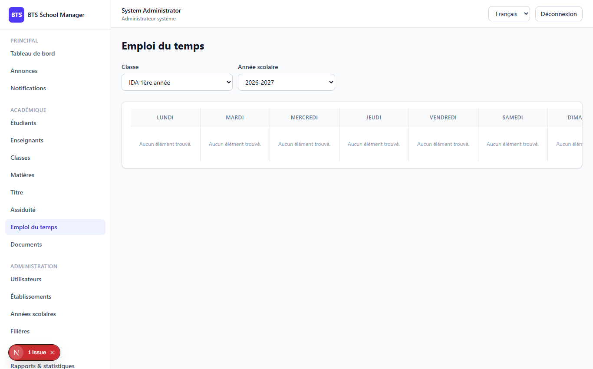

# Phase 7 — Timetables (Schedules) & Rooms

> **What this phase does:** adds **weekly timetables** per class and the ability to manage
> **rooms** (classrooms). A *schedule slot* is one lesson: which class, subject, teacher,
> room, day of the week, and start/end time. Timetables are shown as a visual weekly grid
> (Monday → Sunday).

---

## 1. The Schedule screen (`/dashboard/schedule`)

The schedule page shows a **weekly grid** for a chosen class and academic year, plus a
**Rooms** tab for managing rooms.



---

## 2. What a schedule slot holds

A `Schedule` row links together everything needed for one lesson:

```php
// fields on schedules table
class_id          // which class
subject_id        // which subject
teacher_id        // which teacher (optional)
room_id           // which room (optional)
academic_year_id  // which school year
day_of_week       // monday, tuesday, ... sunday
start_time        // "08:30"
end_time          // "10:00"
```

The validation (in `StoreScheduleRequest`) enforces:

- `day_of_week` is one of `monday..sunday`
- `start_time` / `end_time` use the `H:i` (24-hour) format

---

## 3. The Rooms feature

A **room** belongs to a school and has a name, code, capacity and type. The controller is
straightforward CRUD with school scoping and a `schedules_count` so the interface can show
how many lessons use each room:

```php
$query = Room::query()
    ->with('school')
    ->withCount('schedules')
    ->when($request->filled('search'), fn ($q) => $q->where(fn ($sub) =>
        $sub->where('name', 'like', "%{$s}%")
            ->orWhere('code', 'like', "%{$s}%")
            ->orWhere('type', 'like', "%{$s}%")))
    ...

if ($request->user()->isEstablishmentAdmin()) {
    $query->where('school_id', $request->user()->school_id);
}
```

---

## 4. Permissions & scoping

New permissions were introduced for this phase:

- `rooms.*` and `schedule.*` — **system admin** and **establishment admin** get full CRUD.
- `teacher` and `student` get **`rooms.view`** and **`schedule.view`** (read only).

Scoping notes:

- **Rooms:** school-scoped; establishment admin's `school_id` is forced.
- **Schedules:** scoped via `class → program → school`. A teacher only sees their own
  slots **or unassigned** ones (`teacher_id === null`), just like attendance:

```php
// teacher view scope
$query->where(fn ($q) => $q->where('teacher_id', $teacher->id)->orWhereNull('teacher_id'));
```

A teacher can *manage* (edit/delete) only slots where they are the teacher:

```php
if ($request->user()->isTeacher()) {
    $teacher = Teacher::where('user_id', $request->user()->id)->first();
    return $teacher && $schedule->teacher_id === $teacher->id;
}
```

---

## ✅ What this phase gives you

- A visual **weekly grid** (Mon–Sun) per class + academic year.
- Add / remove **schedule slots** on the grid.
- A **Rooms tab** with full room CRUD.
- New `rooms.*` and `schedule.*` permissions and consistent scoping.

---

**Next:** Phase 8 adds Announcements, Notifications & Documents.
➡️ [08-phase8-communication-documents.md](08-phase8-communication-documents.md)
