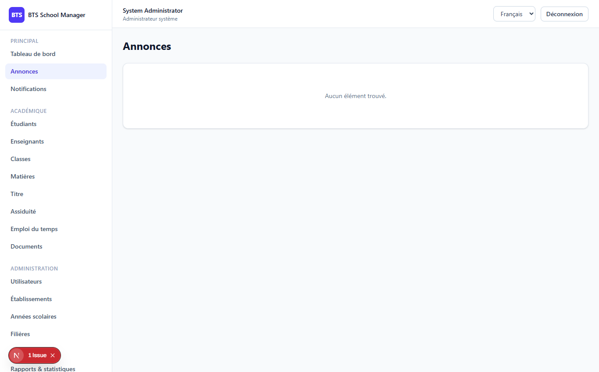
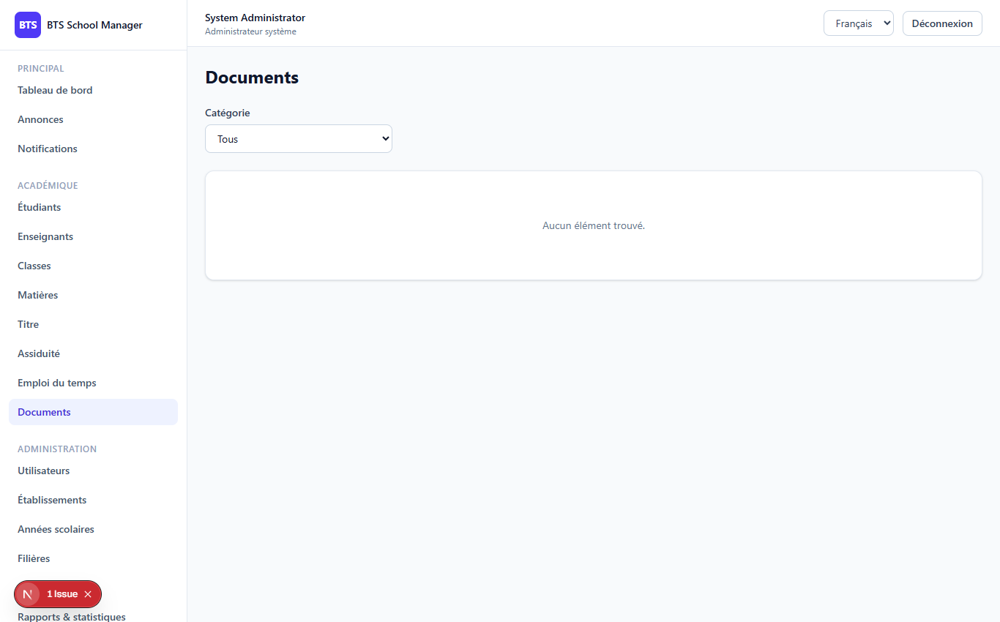
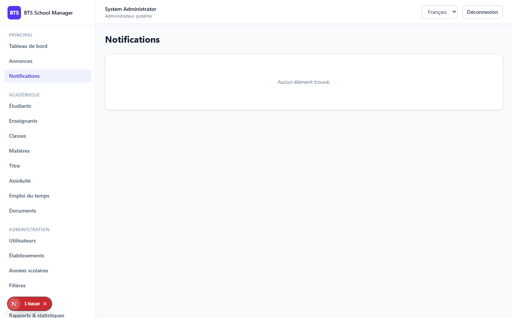

# Phase 8 — Announcements, Notifications & Documents

> **What this phase does:** adds the **communication** features and **document storage**.
> Three new modules:
>
> 1. **Announcements** — publish news to everyone, teachers, students, a class or a program.
> 2. **Notifications** — a per-user notification center; publishing an announcement
>    generates a notification for each targeted user.
> 3. **Documents** — upload, list, download, update and delete files (with visibility
>    rules for public vs. private).

---

## 1. The screens

### Announcements (`/dashboard/announcements`)

Create and manage announcements, pick the audience, and publish (or keep as draft).



### Documents (`/dashboard/documents`)

Upload files, filter by category, see a visibility badge, download and delete.



### Notifications (`/dashboard/notifications`)

See your own notifications, click to mark read, or mark all as read.



---

## 2. Announcements — how targeting works

An **announcement** has an `audience`:

```
everyone | teachers | students | class | program
```

The audience decides *who gets a notification*. The `targetUserIds` method turns the
audience into a list of user IDs:

```php
private function targetUserIds(Announcement $announcement): array
{
    $schoolId = $announcement->school_id;

    return match ($announcement->audience) {
        'teachers' => User::where('school_id', $schoolId)->where('role', 'teacher')->pluck('id')->all(),
        'students' => User::where('school_id', $schoolId)->where('role', 'student')->pluck('id')->all(),
        'class'    => $this->studentUserIdsForClasses([$announcement->class_id]),
        'program'  => $this->studentUserIdsForProgram($announcement->program_id),
        default    => User::where('school_id', $schoolId)->where('role', '!=', 'admin_system')->pluck('id')->all(),
    };
}
```

`is_published` is a **computed** value: the announcement is "published" when it has a
`published_at` date **and** (it has no `expires_at`, or that date is still in the future).

When an announcement is saved and is published, the backend **synchronizes notifications** —
it deletes old ones for that announcement and creates a fresh one per targeted user:

```php
private function syncNotifications(Announcement $announcement): void
{
    if (! $announcement->is_published) {
        UserNotification::where('announcement_id', $announcement->id)->delete();
        return;
    }

    UserNotification::where('announcement_id', $announcement->id)->delete();
    foreach ($this->targetUserIds($announcement) as $userId) {
        UserNotification::create([
            'user_id'        => $userId,
            'announcement_id'=> $announcement->id,
            'type'           => 'announcement',
            'title'          => $announcement->title,
            'body'           => mb_strimwidth($announcement->content, 0, 200, '…'),
            'action_url'     => '/dashboard/announcements',
        ]);
    }
}
```

> Note: users who don't have an account (e.g. a student with no linked user login) never
> get a notification — the system can't notify someone who can't log in.

---

## 3. Notifications — only your own

The notifications controller always operates on **the logged-in user's own rows**:

```php
public function index(Request $request)
{
    $notifications = UserNotification::query()
        ->where('user_id', $request->user()->id)   // <-- only MY notifications
        ->orderByDesc('created_at')
        ->paginate(...);
    return UserNotificationResource::collection($notifications);
}

public function markRead(Request $request, UserNotification $notification)
{
    if ($notification->user_id !== $request->user()->id) {
        return response()->json(['message' => 'Resource not found.'], 404);
    }
    $notification->update(['is_read' => true]);
    return new UserNotificationResource($notification);
}
```

Plus an unread-count helper and a "mark all read" endpoint.

---

## 4. Documents — upload & visibility

The document upload uses Laravel's **file storage** (local disk, `documents/` folder).
When storing, it reads the file, saves it, and records its metadata:

```php
$file = $request->file('file');
$path = $file->store('documents');

$data['user_id']    = $request->user()->id;
$data['file_path']  = $path;
$data['file_name']  = $file->getClientOriginalName();
$data['mime_type']  = $file->getMimeType();
$data['file_size']  = $file->getSize();
$data['is_private'] = $data['is_private'] ?? true;

$document = Document::create($data);
```

Validation restricts uploads to document types (e.g. `pdf, doc, ...`) and a max size
(20 MB in the FormRequest).

**Visibility rule:** a document marked `is_private = true` is only visible to its owner,
the school admin, or the system admin. A shared (`false`) document is visible school-wide.
The list is always **school-scoped**.

On the frontend, **downloads** are done client-side by fetching the file as a **blob** so
the authentication token is included (a normal browser `<a download>` link would not send
the Bearer token).

---

## 5. Permissions

- `announcements.*`, `notifications.*`, `documents.*`
  - **system admin** and **establishment admin**: full control.
  - **teacher**: `announcements.view` + `documents.view/create`.
  - **student**: view-only.

---

## ✅ What this phase gives you

- **Announcements** with targeting (everyone / teachers / students / class / program),
  publish/draft and expiry.
- A **notification center** (unread count, mark read, mark all read).
- **Document upload/download** with category filter, visibility badges and management.
- Automatic notification generation when announcements are published.
- School scoping + permissions throughout.

---

**Next:** Phase 9 adds Reports & Analytics.
➡️ [09-phase9-reports-analytics.md](09-phase9-reports-analytics.md)
