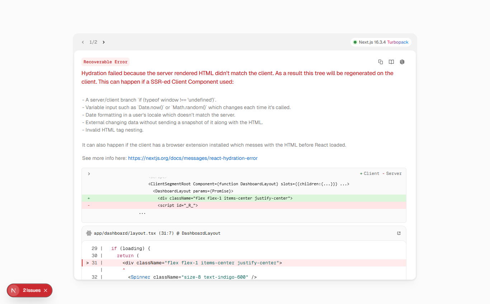

# Phase 9 — Reports & Analytics

> **What this phase does:** adds a **reports / analytics** dashboard. It turns raw data
> into useful numbers: summary KPIs, student distribution, grade averages and attendance
> rates. Everything is school-scoped and can be filtered by academic year.

---

## 1. The Reports screen (`/dashboard/reports`)

The reports page shows KPI cards and simple CSS bars so managers can quickly see how the
school is doing. It can be filtered by academic year.



---

## 2. The four report endpoints

The `ReportController` exposes four **read-only** analytics endpoints under `/reports`:

| Endpoint | What it returns |
|----------|-----------------|
| `GET /reports/summary` | Counts (students, active students, teachers, classes, programs, assessments) + grade average + attendance rate |
| `GET /reports/students` | Student distribution by **status**, **gender**, **class** and **program** |
| `GET /reports/grades` | Overall average, **pass rate** (scores ≥ 10), average by class and by subject |
| `GET /reports/attendance` | Total/present records, overall rate, by status and by class |

Each shares two helpers that decide *which school* and *which academic year*:

```php
private function resolveSchoolId(Request $request): int
{
    if ($request->user()->isEstablishmentAdmin()) {
        return $user->school_id;            // forced to your own school
    }
    return (int) ($request->input('school_id') ?: $user->school_id);
}

private function resolveYearId(Request $request, int $schoolId): ?int
{
    if ($request->filled('academic_year_id')) {
        return (int) $request->input('academic_year_id');
    }
    // default: the school's current academic year
    return (int) AcademicYear::where('school_id', $schoolId)->where('is_current', true)->value('id');
}
```

So an establishment admin always sees **their own school**, and by default you get the
**current** academic year.

---

## 3. Example: computing grade stats

The grades endpoint joins grades → assessments → classes, restricted to the school's
classes, and (optionally) to a year. It computes the overall average, the **pass rate**
(scores ≥ 10), and averages grouped by class and subject.

The pass-rate helper:

```php
private function computePassRate(int $schoolId, $classIds, ?int $yearId): float
{
    $query = Grade::query()
        ->join('assessments', 'assessments.id', '=', 'grades.assessment_id')
        ->join('classes', 'classes.id', '=', 'assessments.class_id')
        ->whereIn('classes.id', $classIds);

    if ($yearId) $query->where('assessments.academic_year_id', $yearId);

    $result = $query
        ->selectRaw('count(*) as total, sum(case when grades.score >= 10 then 1 else 0 end) as passed')
        ->first();

    $total = (int) ($result->total ?? 0);
    return $total > 0 ? round(((int) ($result->passed ?? 0) / $total) * 100, 1) : 0.0;
}
```

---

## 4. Example: attendance analytics

The attendance endpoint counts records across the school's attendance sessions, then
groups them by status and by class. Per class it also reports a `present_rate`:

```php
'present_rate' => $total > 0 ? round(((int) $row->present / $total) * 100, 1) : 0,
```

---

## 5. How scoping flows through the data

The analytics follow the chain:

```
Grade / Assessment / AttendanceRecord
   → the assessment/session's class
   → classes.program_id
   → programs.school_id
```

This is exactly the same "school scoping" idea from Phase 2, applied consistently to the
statistics.

---

## 6. Permissions & frontend

- `reports.view` — granted to **system admin**, **establishment admin**, **teacher** and
  **student**.
- `reports.generate` — available for generating/exporting.

The frontend reports page is guarded by `reports.view`. It uses only **CSS bars** (no
chart library) for the distribution, keeping the UI lightweight. The KPI cards use the
reusable `StatCard` component from Phase 1's design system.

---

## ✅ What this phase gives you

- Four analytics endpoints (summary, students, grades, attendance).
- KPI cards + distribution bars + per-class averages and attendance rates.
- School scoping and academic-year filtering.
- A lightweight, dependency-free chart presentation (pure CSS).

---

**Next:** Phase 10 prepares the app for Production.
➡️ [10-phase10-production.md](10-phase10-production.md)
